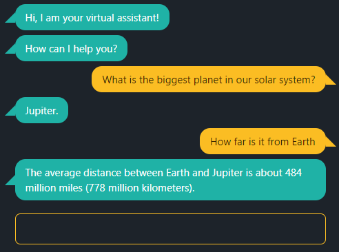

# tinker-chat

This chat app supports GPT from OpenAI or your own local LLM.

### GPT from OpenAI

To use GPT from OpenAI, set the environment variable `OPENAI_API_KEY` to your [API key](https://platform.openai.com/account/api-keys).

### Local LLM

To use a local LLM, first you need an OpenAI-compatible server:

1. Install [LocalAI](https://localai.io/).
2. Download a compatible model, e.g. [Llama-2-13B-Chat-GGML](https://huggingface.co/TheBloke/Llama-2-13B-Chat-GGML).
3. Place the model in the LocalAI's `models` directory.
4. Run LocalAI.

Before launching the demo, set these environment variables:
```
export CHAT_MODEL='llama-2-13b-chat.ggmlv3.q4_0.bin'
export OPENAI_API_BASE='http://127.0.0.1:8080'
```

## Demo

With [Node.js](https://nodejs.org) >= v18:

```
npm install
npm start
```

and open `localhost:5000` with a web browser.

