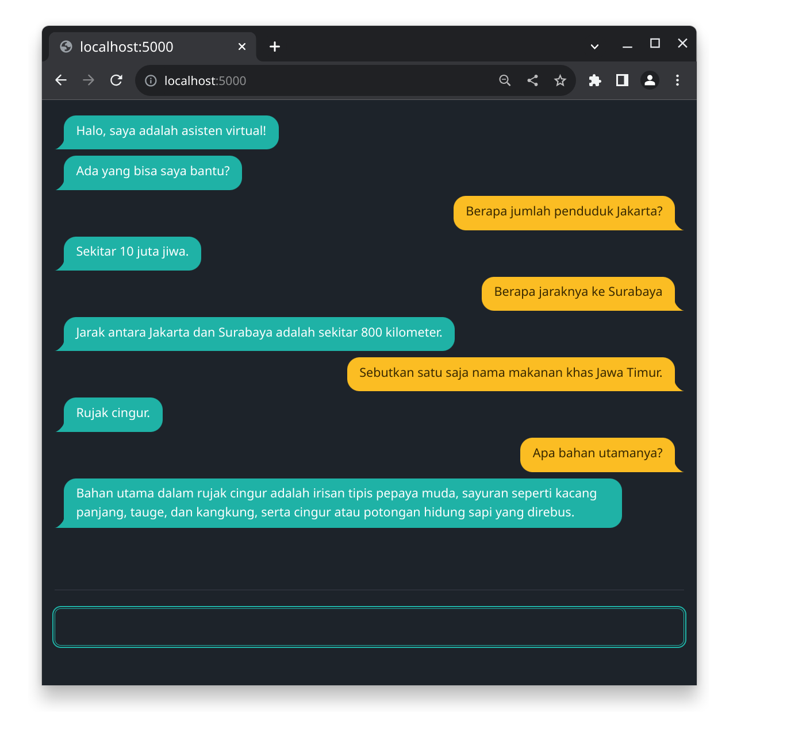

# tinker-chat



This chat app supports GPT from OpenAI or your own local LLM.

### GPT from OpenAI

To use GPT from OpenAI, set the environment variable `OPENAI_API_KEY` to your [API key](https://platform.openai.com/account/api-keys).

### Local LLM

To use a local LLM, first obtain and build [llama.cpp](https://github.com/ggerganov/llama.cpp) (this process typically takes only 5 minutes). And then, download a compatible model, such as [Dolphin 2.6 variant of Phi 2](https://huggingface.co/TheBloke/dolphin-2_6-phi-2-GGUF). Run llama.cpp's inference server with the downloaded model, e.g.:

```
./server -m /path/to/dolphin-2_6-phi-2.Q4_K_M.gguf
```

Before launching the demo, ensure that `OPENAI_API_BASE` is set to `http://127.0.0.1:8080`,

## Demo

With [Node.js](https://nodejs.org) >= v18:

```
npm install
npm start
```

and open `localhost:5000` with a web browser.
